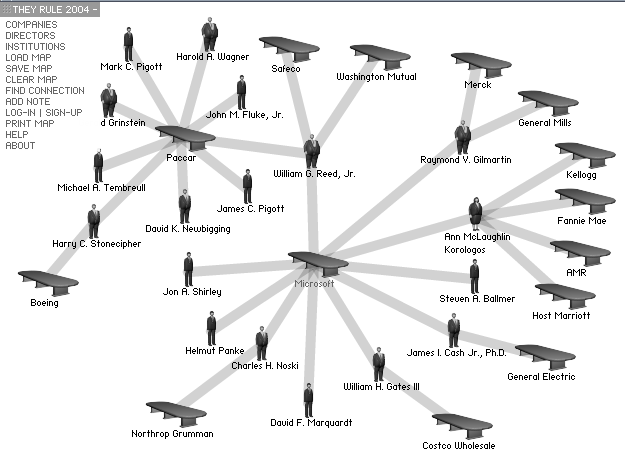

<html><head>
 <title>Pajek data: They Rule 2004</title>
 <meta http-equiv="Content-Type" content="text/html;charset=UTF-8">
 <link rel=StyleSheet href="../esna/esna.css" type="text/css" title="ESNA Style" media="screen, print">
</head>
<body bgcolor="darkgreen">

<table width="650" bgcolor="lightyellow" cellpadding="10" border="0" bordercolor="brown"><tbody><tr><td>

<h1>Pajek datasets</h1>

<h2>They Rule 2004</h2>

<b>Dataset</b> &nbsp; <code>TheyRule</code>

<b>Description</b>

<tt>TheyRule.paj </tt> - 2-mode network Directors(6911) X Companies(517) 
<tt>TheyRuleShort.nam </tt> - Short names 
<tt>TheyRuleR.paj</tt> - TheyRule network with 'missing' units removed;
    Directors(4657) X Companies(510).

<b>Download</b>

<a href="./TheyRule.zip">complete dataset</a> (ZIP, 310K)

<b>Background</b>

The <b><a href="http://www.theyrule.net/">They Rule 2004</a></b> network,

collected by <b>Amy Balkin</b> and <b>Josh On</b>, is/was available

at <b><a href="http://www.theyrule.net/2004/theyrule2004.sql">
 <tt>http://www.theyrule.net/2004/theyrule2004.sql</tt></a></b>.

Josh wrote:
<blockquote>
They Rule aims to provide a glimpse of some of the relationships of
the US ruling class. It takes as its focus the boards of some of the
most powerful U.S. companies, which share many of the same directors.
Some individuals sit on 5, 6 or 7 of the top 500 companies. It allows
users to browse through these interlocking directories and run
searches on the boards and companies. A user can save a map of
connections complete with their annotations and email links to
these maps to others. They Rule is a starting point for research
about these powerful individuals and corporations.

I have put up the they rule database for people to download.
Perhaps someone can make an interface to keep this up to date in some
sort of collaborative fashion. Please let me know if you do something
with this data.  It is probably best that you put a disclaimer on the
data - as it will have some errors in there and it will date.
Amy Balkin and I collated it earlier in 2004 from the top 500 US
corporate websites - and we have included the URLs of the pages on
which we found the info.  This should make it easier for people to
keep up to date.  If someone does keep it up to date - please let us
plug in a they rule front end into your dataset!  Presently, it is in
SQL format, and I think the structure needs some work.  It might make
more sense to break out the connections between the directors and the
companies (and institutions) into a seperate connections table.

Here it is:  <a href='http://www.theyrule.net/2004/theyrule2004.sql'>theyrule2004.sql</a>.
 
<b>Copyright:</b>
Use it as you will, no need to credit us, though we wouldn't object!
Let us know what you do with it: <a href='mailto://josh@theyrule.net'>josh@theyrule.net</a>.
</blockquote>

<b>Some notes</b>

In the network <tt>TheyRule.net</tt> the vertices are numbered as follows:
directors - as in original data; companies - 6911 + original number;
institutions - 7411 + original number. The partition <tt>Types.clu</tt>
has the following clusters:
 0 - missing; 1 - female; 2 - male; 3 - company; 4 - institution.

The file <tt>TheyRule.py</tt> contains a program in
<a href="http://www.python.org/">Python</a> used to transform
the original data into almost Pajek format. The file
<tt>TheyRule2004.sql</tt> contains original data with <tt>', '</tt> inside strings
replaced with <tt>','</tt>.

The file <tt>TheyRuleR.paj</tt> contains the reduced version of the network in
which the 'missing' vertices are removed. The file <tt>Directors.clu</tt>
contains the f/m partition; and <tt>Companies.clu</tt> contains the
comp/inst partition.

<h3>History</h3>
<ol>
 <li> Transformed into Pajek format by V. Batagelj, 21. November 2004.</li>
</ol>

<h3>References</h3>
<ol>
 <li> Josh On:
 <A HREF="http://www.theyrule.net/html/about.php">
 About They Rule 2004</A></li>
</ol>

<a href="../default.htm">Pajek Data</a>;
<a href="http://vlado.fmf.uni-lj.si/pub/networks/pajek/default.htm">Pajek Home</a>

21. November 2004
</td></tr></tbody></table>

</body></html>
