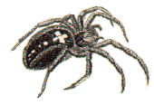

  

#    Old Pajek Data Sets 

  * [Network data sets](https://github.com/bavla/Nets/tree/master/data)
  * [Original version of Pajek Data Sets](http://vlado.fmf.uni-lj.si/pub/networks/data/default.htm) 

## Licenses and Citation 

If the source of the data set is not specified otherwise, these data sets are licensed under a
[Creative Commons Attribution-NonCommercial-ShareAlike 2.5 License](http://creativecommons.org/licenses/by-nc-sa/2.5/).

When publishing results obtained using this data set the original authors should be cited.  In addition, this collection should be cited as:
  * Vladimir Batagelj  and Andrej Mrvar (2003): Pajek data sets.\\ ''<URL: [https://github.com/bavla/Nets/tree/master/data/Pajek](https://github.com/bavla/Nets/tree/master/data/Pajek)>''.

## Networks 

| network  | n  | mE | mA | description |
| ------------------- | ------ | ------- | -------- | ------------------------- |
|[Yeast](http://vlado.fmf.uni-lj.si/pub/networks/data/bio/Yeast/Yeast.htm) |  2361 | 7182 | 0  | biology, protein interactions |
|[Tina](http://vlado.fmf.uni-lj.si/pub/networks/data/soc/Tina/Tina.htm) |  11 |  0 |  29-48 | sociology, (6 relations), measurements |
|[Football](http://vlado.fmf.uni-lj.si/pub/networks/data/sport/football.htm) |  35 |  0 |  118 | sport, valued |
|[Slovene parties 1994](http://vlado.fmf.uni-lj.si/pub/networks/data/soc/Samo/Stranke94.htm) |   10 |  0 |  90 | sociology, valued signed |
|[US presidents](http://vlado.fmf.uni-lj.si/pub/networks/data//GED/Presdnts.GED) |  ?  |  0 |   ?  | genealogy |
|[Turkish nomads](http://vlado.fmf.uni-lj.si/pub/networks/data//GED/P-Tur.GED) |  ?  |  0 |  ?  | genealogy |
|[CS phd](http://vlado.fmf.uni-lj.si/pub/networks/data//GED/CSphd.ZIP) |  1882 |  ?  |  0 | genealogy |
|[US Air lines](http://vlado.fmf.uni-lj.si/pub/networks/data/mix/USAir97.net) |    332 |       0 |  ?  | transport |
|[Cities and services](https://github.com/bavla/Nets/raw/refs/heads/master/data/Pajek/2mode/cities.zip) |  101/55 |      0 |  ?  | valued, 2-mode data|
|[Divorce in US](./2mode/divorce.net) |  59/50 |      0 |   ?  | binary, 2-mode data|
|[Dutch Elite 2006](./2mode/DutchElite.md) |    3810+937 |   5221 |      0 | multirelational, 2-mode |
|[Graph products](./2mode/sandi/Sandi.md) |  674/314 |      0 |   ?  | collaboration, 2-mode |
|[Slovenian magazines  and journals](./2mode/journals.md) |    124 |      0 |  ?  | valued, derived from 2-mode|
|[Computational geometry](http://vlado.fmf.uni-lj.si/pub/networks/data/collab/geom.htm) |  7343 |  11898 |  0 | collaboration |
|[Network theory](http://vlado.fmf.uni-lj.si/pub/networks/data/collab/netscience.htm) |  1589 |  2742 |  0 | collaboration |
|[September 11](http://vlado.fmf.uni-lj.si/pub/networks/data/CRA/terror.htm) |  13332 |  243447 |      0 | text, temporal |
|[HEP / KDD Cup 2003](http://vlado.fmf.uni-lj.si/pub/networks/data/hep-th/hep-th.htm) |  27770 |  352807 |      0 | citation |
|[US patents](http://vlado.fmf.uni-lj.si/pub/networks/data/patents/Patents.htm) |  37774768 |      0 |  16522438 | citation |
|[EVA](http://vlado.fmf.uni-lj.si/pub/networks/data/econ/Eva/Eva.htm) |  8343 |      0 |  6726 | ownership|
|[Graph and Digraph Glossary](http://vlado.fmf.uni-lj.si/pub/networks/data/DIC/TG/glossTG.htm) |      72 |      0 |    122 | dictionary |
|[Erdos](http://vlado.fmf.uni-lj.si/pub/networks/data/Erdos/Erdos02.net) |   6927 |  11850 |      0 | collaboration |
|[The Edinburgh Associative Thesaurus](http://vlado.fmf.uni-lj.si/pub/networks/data/dic/eat/Eat.htm) |   23219 |      0 |  325624 | dictionary |
|[ODLIS](http://vlado.fmf.uni-lj.si/pub/networks/data/dic/odlis/Odlis.htm) |   2909 |      0 |  18419 | dictionary |
|[FOLDOC](http://vlado.fmf.uni-lj.si/pub/networks/data/dic/foldoc/foldoc.htm) |  13356 |      0 |  120238 | dictionary |
|[Words 2-8](http://vlado.fmf.uni-lj.si/pub/networks/data/dic/knuth/dic28.zip) |  ?  |      0 |   ?  | close words |
|[Roget](http://vlado.fmf.uni-lj.si/pub/networks/data/dic/roget/Roget.htm) |   1022 |      0 |   5075 | dictionary |
|[Wordnet](http://vlado.fmf.uni-lj.si/pub/networks/data/dic/Wordnet/Wordnet.htm) |  82670 |      0 |  133445 | dictionary, multi |
|[USF Word Association, Rhyme and Word Fragment Norms](http://vlado.fmf.uni-lj.si/pub/networks/data/dic/fa/FreeAssoc.htm) |  10617 |      0 |  72176 | dictionary |
|[Graph Drawing Contests](http://vlado.fmf.uni-lj.si/pub/networks/data/GD/GD.htm) |  *  |  *  |  *  | collection |
|[GD'99 - Linden strasse](http://vlado.fmf.uni-lj.si/pub/networks/data/GD/a99m.zip) |  234 |   278 |    48 | literature, multi, temporal|
|[GD'01 GD proceedings self-citing](http://vlado.fmf.uni-lj.si/pub/networks/data/GD/a01.zip) |  311 |      0 |   645 | citation|
|[KEDS](http://vlado.fmf.uni-lj.si/pub/networks/data/KEDS/KEDS.htm) |    *  |    *  |    *  | activity, multi, temporal|
|[Notre Dame WWW](http://vlado.fmf.uni-lj.si/pub/networks/data/ND/NDnets.htm) |  325729 |      0 |  1497135 | internet|
|[Notre Dame actors](http://vlado.fmf.uni-lj.si/pub/networks/data/ND/NDnets.htm) |  520223 |  1470418 |  0 | 2-mode|
|[European projects on simulation](https://github.com/bavla/Nets/blob/master/data/Pajek/SimPro.zip) |  *  |  *  |  *  | 2-mode|
|[Citation networks](http://vlado.fmf.uni-lj.si/pub/networks/data/cite/default.htm) |   *  |   *  |   *  | citation / collection|
|[Networks from Exploratory Network Analysis with Pajek](./esna/README.md) |  *  |   *  |   *  | collection|
|[Networks from Generalized Blockmodeling](http://vlado.fmf.uni-lj.si/pub/networks/data/GBM/default.htm) |   *  |   *  |   *  | collection|
|[Food-webs](http://vlado.fmf.uni-lj.si/pub/networks/data/bio/foodweb/foodweb.htm) |  *  |  *  |   *  | collection |
|[UCINET IV datasets](./ucinet/README.md) |      *  |      *  |      *  | collection|
|[Wasserman and Faust datasets](http://vlado.fmf.uni-lj.si/pub/networks/data/WaFa/default.htm) |      *  |      *  |      *  | collection |
|[Mixed networks](http://vlado.fmf.uni-lj.si/pub/networks/data/mix/mixed.htm) |      *  |      *  |      *  | collection |

Created: 11. Oct 2003 / GitHub 16. Nov 2024

