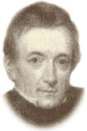

<html>
<head>
  <meta HTTP-EQUIV="Content-Type" CONTENT="text/html;charset=UTF-8">
  <link rel=StyleSheet href="../../esna/esna.css" type="text/css" title="ESNA Style" media="screen, print">
</head>
<body bgcolor=darkgreen>

<table width=650 bgcolor=lightyellow cellpadding=10 border=0 bordercolor=brown><tr><td>
<h1>Pajek datasets</h1>

<h2> Roget Roget's Thesaurus, 1879</h2>

<b>Dataset</b> &nbsp; <code>Roget</code>

<b>Description</b>

 <tt>roget.net</tt> directed network with 1022 vertices and 5075 arcs (1 loop);
      word X is related to word Y.

<b>Download</b>

<a HREF="./ROGET.ZIP">Roget.net</a> (ZIP, 17K)

<b>Background</b>

The network <code>Roget.net</code> is based on the file
<code>roget.dat</code> from the Stanford GraphBase that contains
cross-references in Roget's Thesaurus, 1879.

Dr. Peter Mark Roget (1779-1869) philologist, scientist, physician.
The name Roget could soon become a virtual synonym for the word "synonym".
For those who use Roget's Thesaurus it is one of the three most important
books ever printed...along with The Bible and Webster's Dictionary.
In order to communicate one's exact intention...or one's precise meaning,
the Thesaurus, being a list of synonyms or verbal equivalents, is a necessary tool.
The first draft of the Thesaurus was written in 1805, two years before Webster
started on his dictionary. However for a period of 47 years Dr. Roget used his
manuscript as his personal, secret, treasure trove. Not until he was 73 years
old did he decide to reveal and publish this great manuscript.

Since 1852, Roget's Thesaurus has never been out of print.
In fact, each succeeding edition has increased the popularity of the work.
The original 15,000 words included in the 1805 manuscript has increased to
over a quarter of a million in the 1992 edition (the tenth printing).
With such an increase in size, it is encouraging to notice that the
basic content still remains intact..... for example, where the 1805
Thesaurus traces the word:
<a href="./existence.jpg">existence</a>: "Ens, entity, being, existence,
essence...", the 1992 Thesaurus contains
existence: "existence, being, entity, ens,...essence..."

Each vertex of the graph corresponds to one of the 1022 categories in
the 1879 edition of Peter Mark Roget's <em>Thesaurus of English Words
and Phrases</em>, edited by John Lewis Roget.
An arc goes from one category to another if Roget gave a
reference to the latter among the words and phrases of the former,
or if the two categories were directly related to each other by their
positions in Roget's book. For example, the vertex for category 312
(`ascent') has arcs to the vertices for categories 224 (`obliquity'),
313 (`descent'), and 316 (`leap'), because Roget gave explicit
cross-references from 312 to 224 and 316, and because category 312
was implicitly paired with 313 in his scheme.

<h3>History</h3>

<ol>
<li> Original Roget's Thesaurus was published in 1852.</li>
<li> Peter's son John Luis Roget published the second, improved edition in 1879.</li>
<li> Project Gutenberg Roget's Thesaurus (1911 edition) put into electronic format in 1991.</li>
<li> Graph <code>Roget.dat</code> of cross-references based on the second edition
     was produced for Stanford GraphBase (SGB) in 1992/3.</li>
<li> MICRA (Pat Cassidy) prepared the electronic version of the 1911 Roget's Thesaurus that is widely available on the internet.</li>
<li> SGB Roget.dat transformed in Pajek format: A. Mrvar, 5. December 1996.</li>
</ol>

<h3>References</h3>
<ol>
<li> Peter Mark Roget:
    <a href="http://www.worldwideschool.org/library/books/gnrl/thesaurus/RogetsThesaurus/toc.html">
    Roget's Thesaurus of English Words and Phrases</a></li>
<li> Project Gutenberg: <a href="http://www.gutenberg.net/browse/BIBREC/BR22.HTM">Roget's Thesaurus</a></li>
<li> Donald E. Knuth:
  <a href="http://www-cs-faculty.stanford.edu/~knuth/sgb.html">
  The Stanford GraphBase: A Platform for Combinatorial Computing </a>.
  New York: ACM Press, 1993</li>
<li> The Stanford GraphBase:
  <a href="ftp://labrea.stanford.edu/pub/sgb/roget.dat"><code>roget.dat</code></a>,
  version 15.6.1993</li>
<li> Pat Cassidy: <a href="http://www.micra.com/factotum/">MICRA / Factotum</a></li>
<li> <a href="ftp://ftp.gnu.org/gnu/gcide/">CIDE</a>
     (Collaborative International Dictionary of English), GNU 1996-2002</li>
</ol>

23. January 2004
</td></tr></table>

</body>
</html>

[Pajek network data sets](../../README.md);
[Network data sets](../../../README.md)

