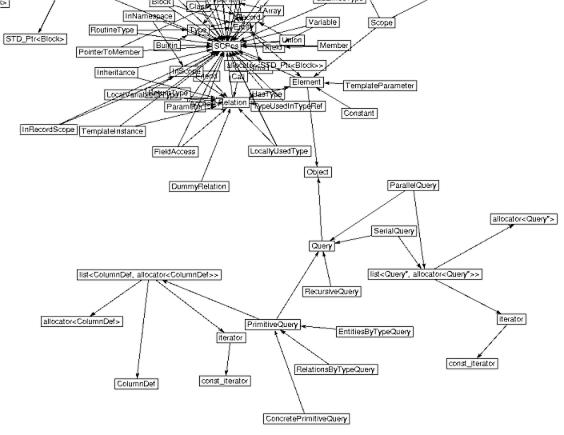

<!doctype html public "-//w3c//dtd html 4.0 Transitional//EN">
<html>
 <head>
<title>GD2000: Graph Drawing Contest - Graph A</title>
</head>

<body bgcolor="#FFFFFF">

<h1><a href="./Rules00.htm">GD2000: Graph Drawing Contest</a></h1>
<h2>Graph A</h2>

Contributed by <em>Michael Himsolt</em>, DaimlerChrysler Research Labs

<h2>Background</h2>

Graph A shows the classes and relationships from a software project. 

The following image shows a small part of the graph:

<h2>Task</h2>

The primary task is to illustrate the structure of the software.

<h2>Data</h2>

<a href="Passau1.gml">Graph A</a> in GML-format.

</body>
</html>
