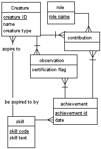

<!doctype html public "-//w3c//dtd html 4.0 Transitional//EN">
<html>
 <head>
<title>GD2000: Graph Drawing Contest - Graph C</title>
</head>

<body bgcolor="#FFFFFF">

<h1><a href="./Rules00C.htm">GD2000: Graph Drawing Contest</a></h1>
<h2>Graph C</h2>

Contributed by <em>John V. Carlis</em>, University of Minnesota

<h2>Background</h2>

<i>
This is a real, in-use data model. However, all names in the model have been changed to Xs to protect the intellectual investment. We are grateful to John Carlis of the University of Minnesota and John Hanna of US West in Minneapolis,
for posing the problem.
</i>

A data model is a technology-independent statement of the kinds of data to be remembered by a database management system. For this contest we have simplified the drawing to include just entities, attributes, and binary relationships. Graphically, each entity appears as a box (a rectangle), each attribute appears as text within an entity's box, and each relationship appears as a line between two (not necessarily distinct) entities.

Figure 1. A Tiny Data Model.(Source: "Mastering Data Modeling: A User-Driven Approach", John Carlis and Joseph Maguire, Addison-Wesley-Longman, 2000.)

A data model (Figure 1 shows a tiny model) is <i>read</i> by users and modelers during a design process. For example, about each Creature 6 things can be remembered: 3 attributes and 3 links to other entities. As users make decisions, the model evolves.

The quality of the graph significantly impacts the design process. A poorly drawn graph means an unreadable model.

<!-- 
The current data model, which has about 770 entities, 5000 -->
<!-- attributes and 1125 relationships, is printed on a 36” plotter and is about 6 -->
<!-- ft by 10 feet. -->
<!-- 
 -->

<h2>Task</h2>

You should produce one or more graph drawings that depict the data model.

<h3>Notes:</h3>
<ol>
  <li>An entity box must be big enough to contain the entity name plus its attribute names. However,
      it can be bigger.
  <li>A line can attach to a box anywhere on its perimeter.
</ol>

<h2>Data</h2>

<a href="carlis.gml">Graph C</a> in GML-format. The label the node consists of several lines. The first line is the name of the entity and the others are its attributes (one per line).

</body>
</html>
