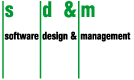

<!doctype html public "-//w3c//dtd html 4.0 Transitional//EN">
<html>
  <head>
    <title>GD2002: Graph Drawing Contest</title>
    <!-- Changed by: Vladimir Batagelj, 19-Jun-2005 -->
  </head>

  <body>

    

    <h1>GD2002: Graph Drawing Contest</h1>
    <h2>Organized by Franz J. Brandenburg</h2>
    

    <h2>Introduction</h2>

    
The graph drawing competition and the nomination of the winners has been among
      the highlights of the past graph drawing symposia. It's both fun and a challenge
      and has inspired new research in graph drawing.

    
The ninth annual graph-drawing contest will be held in conjunction with Graph Drawing 2002.

    <table>
      <tr>
        <td><a href="indexA.htm">Graph_A</a></td>
        <td>Knowledge Nation</td>
      </tr>
      <tr>
        <td><a href="indexB.htm">Graph_B</a></td>
        <td>The crown</td>
      </tr>
      <tr>
        <td><a href="indexC.htm">Graph_C</a></td>
        <td>is the interactive Graph Analysis</td>
      </tr>
    </table>

    
Winning entries for each graph will be chosen by a jury of experts. Drawings of GraphA and GraphB may be submitted electronically or by mail.
      All submissions must be received before midnight, August 21, 2002. (Note: This is a hard deadline.)
      A prize fund of $750 is anticipated. As usual, the winning entries will be described in the GD symposium proceedings.

    <h2>How to Enter the Competition</h2>

    Graphs A, B, and C and incidental background information are available via the above links.

    
Unless contradicted by the specific instructions for each graph, you are free to use any visual or textual mechanism to communicate the graph data.

    
The primary judging criterion will be how well the drawings or interaction convey this data. A secondary criterion will be the degree to which manual editing was required to produce them: the less manual intervention, the better.

    
You can submit entries of any or all of these graphs before midnight, August 21, 2002.
      Drawings can be submitted electronically in Postscript or PDF format to Franz Brandenburg (
      <a href="mailto:brandenb@fmi.uni-passau.de">brandenb@fmi.uni-passau.de</a>).

    
Questions or comments should be directed to Franz Brandenburg (<a href="mailto:brandenb@fmi.uni-passau.de">brandenb@fmi.uni-passau.de</a>).

    <h2>Sponsors</h2>

    <ul>
      <li>Mitsubishi Research Labs (MERL), Cambridge, Mass., USA</li>
      <li>Tom Sawyer Software, Berkeley, USA</li>
      <li>,
      Munich, Germany</li>
    </ul>

    More sponsors are welcome!

    Anybody is invited as a sponsor. Please, contact the chairman.

    

    <b>I'm looking forward to nice drawings</b>
    

    <b>Franz J. Brandenburg</b>
    

    

  </body>
</html>
