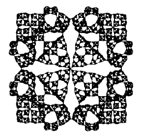

<html>
<head>
	<title>Graph Drawing 2004</title>
<link rel="stylesheet" type="text/css" href="gd2004.css" title="style1">
<meta name="Description" content="Graph Drawing 2004">
<meta name="keywords" content="mathematics, graphs, drawing, ccny">

<base target="_top">
</head>

<body bgcolor="#D5D5D5">

</a>

<h2>11th Annual Graph Drawing Contest</h2>

<h3> GD 2004 Challenge Graphs </h3>

<ul> 
<li> Download the challenge graphs: <a href="http://www.cs.miami.edu/~duncan/challenge.zip">challenge.zip</a>
<li> Email submissions to kobourov@cs.arizona.edu by 8:00pm EST, Sept 29.
<li> Include the following information in your email:
<ul>
	  <li> Names and affiliation of contestants
	  <li> Method used: program (which one?), manual, combination (percentage manual?)
	  <li> Zipped file of your graphs
</ul>
</ul>

<h3> GD 2004 Contest Rules </h3>

The graph drawing contest has two distinct tracks: the graph drawing challenge and the freestyle contest. To view the detailed rules for the GD 2004 Graph Drawing Contest, please click <a href="contest.pdf">here</a>. 

Here is a brief overview of the graph drawing challenge:

<ul>

<li> The graph drawing challenge will take place on September 29th at the
conclusion of the afternoon session.

<li> The challenge graphs will be announced at 6:30pm and submissions will be due by email by 7:30pm.

<li> This year's challenge will be crossing minimization.

<li> Teams of one to three participants will be allowed.

<li> Teams may bring their own software and computers for the challenge.

<li> Lab space and a simple graph editor will be provided for teams that did not bring computers/software.

<li> The graph editor program is available for download (Linux: <a
href="GraphMan-0.6.tgz">GraphMan-0.6.tgz</a> and Windows <a
href="GraphMan.jar">GraphMan.jar</a> ). See the <a
href="GraphMan.html">About GraphMan</a> webpage for overview of the
program.

</ul>

<h3> Graph Format </h3>

For the GD2004 contest, we will use a modified ASCII format described below. The contest graphs will be provided in this format and the submission should be prepared using the same format.
<ul>
<li>The first number indicates the number of nodes in the graph.
<li>The next 2N double values are X Y pairs for each node, indicating
its position, which initially are random values.
<li> The remaining values are integer pairs <a B> indicating an edge exists between nodes A and B.   

<li> The nodes are labeled from 0 to N-1 and the order from the input file must be used in the output file as well.
<li> The contest graphs will not contain comments though they are allowed.
<li> Edge order is not important.
<li> The contest graphs will have random start locations for the nodes.
</ul>

<h3> Sample File </h3>
Below is a simple example: 

----------------------------------------------------------------- 
# Lines starting with # are comments and ignored 
# First value is NumNodes(N) 
4  
# Next N pairs are X,Y (double) coordinate values of each node 0,1, N-1 
0.0 0.0  # Node 0 
0.0 5.0  # Node 1 
5.0 5.0  # Node 2 
5.0 0.0  # Node 4 

# Remaining pairs of INTEGER values are undirected edges Ns, Ne 
0 1      # Edge from Node 0 to Node 1 
0 2 
0 3 
1 2 
1 3 
2 3 
 
# Here we defined a 4-clique (with 1 crossing) 

----------------------------------------------------------------- 

Additional sample files can be found here: 
<ul>
<li><a href="sample1.gd4">sample1.gd4</a>
<li><a href="sample2.gd4">sample2.gd4</a>
<li><a href="sample3.gd4">sample3.gd4</a>
</ul>

<h3> Contact </h3>

Stephen Kobourov 

<a href="http://www.cs.arizona.edu/~kobourov ">http://www.cs.arizona.edu/~kobourov </a>

</body>
</html>
