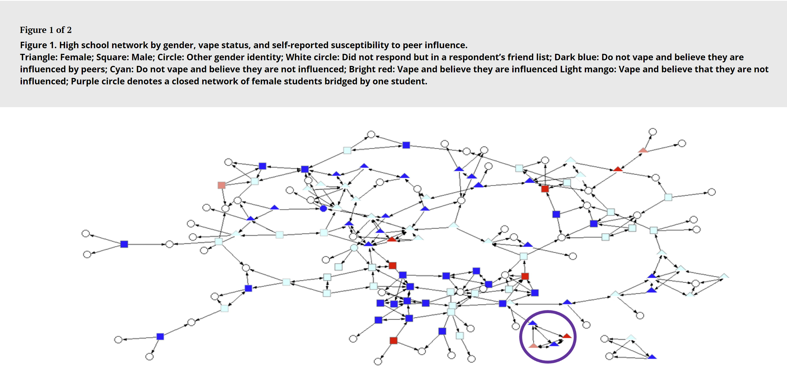

# Vape

Network from the paper
  - [Applying Social Network Theory to Vaping in High School: Implications for Person-Centered Intervention](https://www.tandfonline.com/doi/full/10.1080/10826084.2024.2359714)
  - https://github.com/njha02/surveyAnalysis    

The survey included gender, age, level of education, vape status, and peer influence status. Vape status was positive if the student responded "true" to vaping at least once every 2 weeks. Students were also asked to list three friends in their high school in order of decreasing  strength of the friendship (friendship tie strength of one being weakest, i.e. friend listed last, and three being strongest).

Converted to Pajek by Vladimir Batagelj, August 1, 2024

